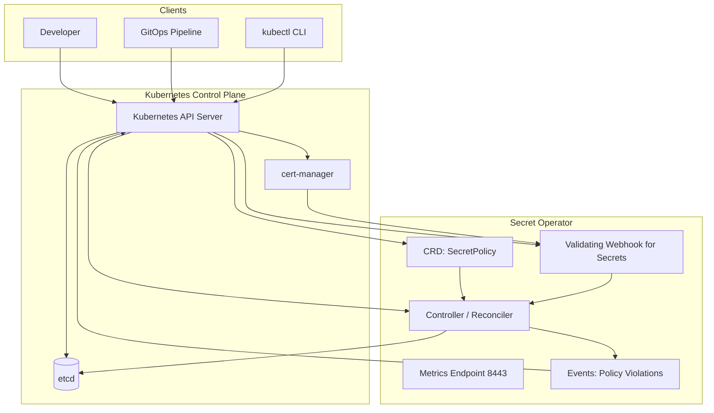

# Secret Governance & Compliance Operator


[](https://github.com/Kisor-S/Secret-governance-and-compliance-operator/actions/workflows/ci.yml)


The **Secret Governance & Compliance Operator** is a Kubernetes operator that enforces **security and compliance policies for Secrets** across your cluster.

It introduces a `SecretPolicy` custom resource and a **validating admission webhook** to ensure that every `Secret` created or updated in the cluster complies with your organization’s rules (encoding, allowed keys, namespaces, types, etc.).

> Think of it as a guardrail: it prevents misconfigured or insecure Secrets from ever being stored in the cluster.

---

## Table of contents

- [Motivation](#motivation)
- [High-level features](#high-level-features)
- [Why not just use SealedSecrets or ExternalSecrets?](#why-not-just-use-sealedsecrets-or-externalsecrets)
- [Core concepts](#core-concepts)
  - [SecretPolicy CRD](#secretpolicy-crd)
  - [Validation modes](#validation-modes)
- [Architecture](#architecture)
- [Installation](#installation)
- [Quick start](#quick-start)
  - [1. Create a SecretPolicy](#1-create-a-secretpolicy)
  - [2. Try creating a violating Secret](#2-try-creating-a-violating-secret)
  - [3. Check events and logs](#3-check-events-and-logs)
- [Metrics](#metrics)
- [Development](#development)
- [Project layout](#project-layout)
- [Future work](#future-work)
- [License](#license)

---

## Motivation

Kubernetes `Secret` objects are easy to create, but:

- They are often **misused** (plaintext values, PEM blobs, mixed formats).
- Different teams follow **inconsistent patterns** (key names, types, namespaces).
- Cluster admins need **enforceable policies**, not just documentation and best-effort reviews.

This operator provides a **policy-driven, webhook-enforced** way to control how Secrets are created and updated, so insecure or non-compliant Secrets never make it into the cluster.

---

## High-level features

- **Secret validating webhook**
  - Validates `corev1.Secret` resources on **create** and **update**.
  - Blocks secrets that violate configured policies.

- **SecretPolicy CRD**
  - Defines **cluster-level** rules for Secret governance.
  - Controls what is allowed/denied for Secrets (keys, types, namespaces, encoding, etc.).

- **Base64 enforcement**
  - Supports **strict** and **relaxed** validation of Secret data.
  - Understands that Kubernetes’ `.data` fields are already base64-decoded in the API server.

- **Policy dimensions**
  - Allowed / disallowed Secret keys.
  - Allowed namespaces.
  - Allowed Secret types.
  - Hooks for external KMS or additional validation logic.

- **Events and observability**
  - Emits Kubernetes **Events** on policy violations.
  - Exposes a **metrics endpoint** for monitoring policy enforcement.

- **Kubernetes-native workflow**
  - Built with **Kubebuilder**.
  - Uses **cert-manager** for webhook certificates and CA injection.
  - Follows idiomatic controller-runtime patterns.

---

## Why not just use SealedSecrets or ExternalSecrets?

Tools like **SealedSecrets** and **ExternalSecrets Operator** solve different problems.  
They **do not** enforce governance or compliance rules on Secrets inside the cluster.

### ✅ SealedSecrets (Bitnami)
SealedSecrets focuses on **encrypting Secrets before they reach the cluster**.

It does **not**:

- Validate Secret keys  
- Enforce allowed namespaces  
- Enforce allowed Secret types  
- Enforce base64 encoding rules  
- Block insecure or non‑compliant Secrets  
- Provide policy‑driven governance  

### ✅ ExternalSecrets Operator (ESO)
ESO syncs secrets **from external providers** (AWS, GCP, Vault, etc.).

It does **not**:

- Validate Secrets created manually  
- Validate Secrets created by apps  
- Enforce key/type/namespace rules  
- Enforce encoding rules  
- Provide cluster‑wide governance  

### ✅ What This Operator Provides (That Others Don’t)

| Capability | SealedSecrets | ExternalSecrets | This Operator |
|-----------|---------------|-----------------|---------------|
| Validates every Secret on create/update | ❌ | ❌ | ✅ |
| Enforces allowed/denied keys | ❌ | ❌ | ✅ |
| Enforces allowed namespaces | ❌ | ❌ | ✅ |
| Enforces allowed Secret types | ❌ | ❌ | ✅ |
| Strict/relaxed base64 enforcement | ❌ | ❌ | ✅ |
| Emits Kubernetes Events for violations | ❌ | ❌ | ✅ |
| Policy-driven governance | ❌ | ❌ | ✅ |
| Works with Secrets from *any* source | ✅ | ✅ | ✅ |

### ✅ Summary

- **SealedSecrets** protects Secrets *in transit*.  
- **ExternalSecrets** syncs Secrets *from external stores*.  
- **This operator** enforces *how Secrets must look once they are inside the cluster*.  

They are **complementary**, not competing.

---

## Core concepts

### SecretPolicy CRD

A `SecretPolicy` CR defines how Secrets should be governed. At a high level, it can express:

- **Where** Secrets are allowed  
  - e.g., only in specific namespaces

- **What keys** are allowed or denied  
  - e.g., `allowedKeys`, `disallowedKeys`

- **Which Secret types** are allowed  
  - e.g., only `kubernetes.io/dockerconfigjson`, `kubernetes.io/tls`, etc.

- **How data must be encoded**  
  - strict vs relaxed base64 enforcement

The operator’s controller watches `SecretPolicy` resources and uses them as input when the webhook validates incoming `Secret` objects.

> The detailed `SecretPolicy` schema lives under `api/v1alpha1`.

---
### Validation modes

The webhook supports **different base64 enforcement modes** to balance security and compatibility:

- **Strict mode**
  - Rejects values that look like plaintext or PEM bundles.
  - Ensures values adhere strictly to base64 expectations and policy rules.

- **Relaxed mode**
  - Allows any value that can be safely interpreted according to policy.
  - Useful when integrating with legacy workloads or varied encoding practices.

The operator’s policy evaluation logic is designed to be **modular and testable**, so new modes and rules can be added without rewriting the webhook.

---

## Architecture

The diagram below shows how the components interact inside the cluster.



**Flow overview:**

- Clients (`kubectl`, GitOps, CI/CD) send requests to the **Kubernetes API Server**.
- The API Server:
    - Stores state in **etcd**.
    - Talks to **cert-manager** for webhook certificates.
    - Dispatches **admission requests** to the **Validating Webhook**.
- The **Webhook** evaluates Secrets against **SecretPolicy** and either allows or rejects the request.
- The **Controller**:
    - Watches `SecretPolicy` resources.
    - Emits **Events** and updates status.
- The operator exposes **metrics** on port `8443` for observability.

---

## Installation

> Note: These steps assume:
> 
> - You have a working Kubernetes cluster.
> - `kubectl` is configured.
> - `cert-manager` is installed and ready.

---

## Quick start

### 1. Create a SecretPolicy

Below is an example:

```yaml
apiVersion: compliance.security.local/v1alpha1
kind: SecretPolicy
metadata:
  name: example-secret-policy
spec:
  mode: strict

  # Only allow Secrets in these namespaces
  allowedNamespaces:
    - "prod-*"
    - "secure-apps"

  # Only allow these Secret types
  allowedTypes:
    - kubernetes.io/tls
    - kubernetes.io/dockerconfigjson
    - Opaque

  # Keys that are explicitly allowed
  allowedKeys:
    - username
    - config.json
    - tls.crt
    - tls.key

  # Keys that are explicitly denied
  disallowedKeys:
    - password
    - token
    - privateKey

  # Optional: enforce rotation interval (in hours)
  rotationInterval: 720 # 30 days

  # Optional: require external KMS integration
  externalKMS: false
```

Apply it:
```bash
`kubectl apply -f secretpolicy-strict.yaml`
```

### 2. Try creating a violating Secret

Example: a Secret that uses a disallowed key or violates encoding rules.

```yaml

`apiVersion: v1
kind: Secret
metadata:
  name: bad-secret
  namespace: default
type: Opaque
data:
  password: cGxhaW50ZXh0LXBhc3N3b3Jk # example base64 for "plaintext-password"`
```

Apply it:

```bash

kubectl apply -f bad-secret.yaml
```

The request should be **rejected** by the webhook with a clear error message explaining which rule was violated.


### 3. Check events and logs

Describe the Secret:

```bash

kubectl describe secret bad-secret -n default
```

You should see **Events** emitted by the operator explaining why it was denied.

Check operator logs:

```bash

kubectl logs -n secret-policy-operator-system deploy/secret-policy-operator-controller-manager
```
---

## Metrics

The operator exposes metrics over HTTPS on port `8443` (behind a Service).

Typical metrics include:

- **Policy evaluation counters**
- **Rejected vs allowed Secrets**
- **Webhook request latencies**

You can:

- Scrape metrics with Prometheus by creating a `ServiceMonitor` (if using Prometheus Operator).
- Build alerts around policy violations or webhook errors.

> See the config/ directory for metrics-related configuration such as the metrics service and patches.
> 

---

## Development

### Prerequisites

- Go `1.20+` (align with `go.mod`)
- `docker` or compatible container runtime
- `kubectl`
- `kustomize` (vendored by Kubebuilder via `make` targets)
- A local cluster: `kind`, `minikube`, or similar
- `cert-manager` installed in the cluster

### Common commands

Run unit tests:

```bash

make test
```

Run against a local cluster (without deploying the webhook):

```bash

make run
```

Build and deploy to a local `kind` cluster:

```bash

kind create cluster --name secret-policy
make docker-build IMG=example.com/secret-policy-operator:dev
kind load docker-image example.com/secret-policy-operator:dev --name secret-policy
make deploy IMG=example.com/secret-policy-operator:dev
```

Clean up:

```bash

make undeploy
```

> For more details, see the Makefile and the config/ directory.

---

## Project layout

This repository follows the standard **Kubebuilder** project structure:

- `api/v1alpha1/`
    - `SecretPolicy` API types and schema.
- `internal/controller/`
    - Controllers / reconcilers and business logic.
- `cmd/`
    - Manager entrypoint.
- `config/`
    - Kustomize bases and overlays for:
        - CRDs
        - RBAC
        - Manager deployment
        - Webhook configuration
        - cert-manager integration
        - Metrics service
- `test/e2e/`
    - End-to-end tests that deploy the operator and exercise behavior in a real cluster.
- `hack/`
    - Helper scripts and tooling.
 
---

## Future work

Planned and potential enhancements include:

- **Mutation webhook**
    - Automatically encode or sanitize plaintext Secret values.
- **Richer SecretPolicy semantics**
    - Per-namespace policies, priority rules, exclusions.
- **Status and reporting**
    - Policy status conditions and summary fields.
    - Cluster-wide reports of compliant vs non-compliant Secrets.
- **More metrics and tracing**
    - Per-policy evaluation metrics.
    - Traces for debugging webhook behavior.
- **Helm chart / OCI distribution**
    - Easier installation and versioned releases.

If you’re interested in contributing, feel free to open issues or PRs with ideas, bug reports, or improvements.

---

## ⭐ Support the Project

If you found this useful:

- Star the repo ⭐
- Share it in your DevOps/Kubernetes community

---

## License
This project is licensed under the Apache 2.0 License. See the LICENSE file for details.

---

## Copyright
© 2025 Kisor S. All rights reserved.

